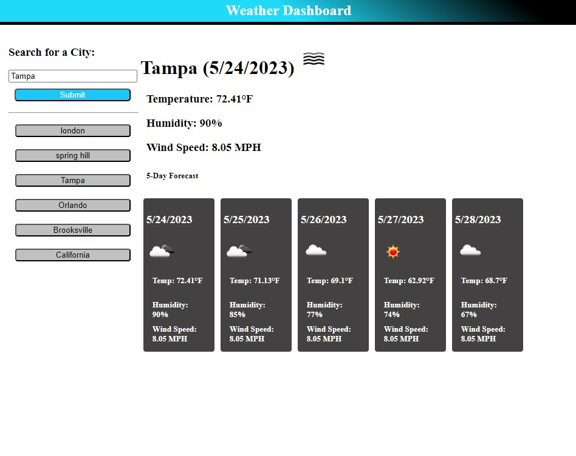

# Meteorology

## Decription

This app was a scratch website using HTML, CSS, JavaScript and pulling an API from openweathermap.org.
Pulling an API from another website was a bit tricky due to waiting for the API code to be actived.
But once up and running you continue to work on the JavaScript and CSS so that your page can react with your design you added.
This app mainly used Javascript which makes your code look simple and clean. Because there isn't a lot of code to view in
each section like HTML. You can also refresh the page and see the cities are still saved in order. Searching a city will
populate the weather that is currently there and the date of today.

## Installation

For this project I had to make an account with openweathermap.org so that I can get my own API from the website.

## User Story

AS A traveler 
I WANT to see the weather outlook for multiple cities 
SO THAT I can plan a trip accordingly

## Acceptance Criteria

GIVEN a weather dashboard with form inputs 
WHEN I search for a city 
THEN I am presented with current and future conditions for that city and that city is added to the search history 
WHEN I view current weather conditions for that city 
THEN I am presented with the city name, the date, an icon representation of weather conditions, the temperature, the humidity, and the the wind speed 
WHEN I view future weather conditions for that city 
THEN I am presented with a 5-day forecast that displays the date, an icon representation of weather conditions, the temperature, the wind speed, and the humidity 
WHEN I click on a city in the search history 
THEN I am again presented with current and future conditions for that city

## Usage

## Links

[Deployed site](https://lexxvasquez.github.io/Meteorology/)

[Github](https://github.com/Lexxvasquez/Meteorology)
